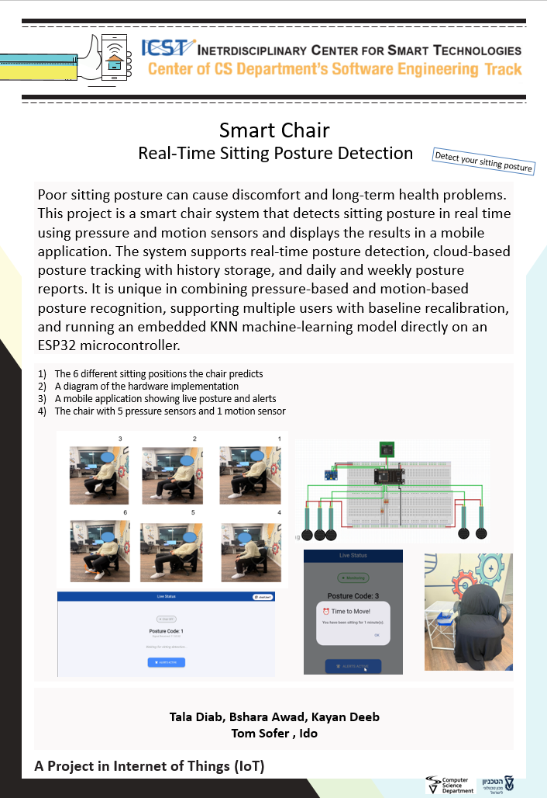

# Smart Chair

## About The Project
We are the students: **Tala Diab, Bshara Awwad, Kayan Deeb**.

our project is a smart chair system that detects sitting posture in real time using pressure and motion sensors and displays the results in an application. The system supports real-time posture detection, cloud-based posture tracking with history storage, and daily and weekly posture reports. It is unique in combining pressure-based and motion-based posture recognition, supporting multiple users with baseline recalibration, and running an embedded KNN machine-learning model directly on an ESP32 microcontroller.

---

## Our Project in Details
We use **two modes** in the project: **Training mode** and **Prediction mode**.

### Training mode (building the dataset)
Training mode is used to **build a larger dataset** that will later be used to predict the user’s posture using the **KNN** machine‑learning model.

**How it works:**
1. **Baseline step:** the user first sits in **Position #1 (straight back)** so the system can save a **baseline** (to support different users and recalibration).
2. The user then goes through the **6 supported positions** (1–6).
3. For each position:
   - The user indicates **which position it is**.
   - The ESP32 samples the **5 FSR sensors + MPU6050** and collects the data.
   - The sample is appended to our **dataset Excel file** (under `DataSet/`) that stores all labeled samples.

**note (button / switch behavior):**
- Each time the user wants to record a **new position sample**, they toggle the **training trigger** from **OFF → ON** (and follow the on‑screen / printed instructions).  
  This ensures each labeled sample is saved as a separate entry in the dataset.

### Prediction mode (real-time inference)
Prediction mode is used to **predict the current sitting posture** using the existing dataset and the embedded **KNN** model.

**How it works (step-by-step):**
1. **Run the prediction firmware** on the ESP32.
2. **Press the button to start.**
3. The user first sits in **Position #1 (straight back)** to save a **baseline**.
   - The baseline is saved to **personalize** the system and reduce the effect of user‑specific factors (e.g., weight distribution and individual seating style) that can affect prediction.
4. After baseline is saved, the user can sit in any posture. The ESP32 continuously predicts the posture using the **dataset + KNN model**.
5. The predicted posture is uploaded to **Firebase**, and the app shows the result immediately.

**Live update rate:**
- The Live Data screen is updated **every 10 seconds** or **immediately when the posture changes**.

---

## Supported Positions (Labels 1–6)
1) Normal sitting (straight back)  
2) Left leg up  
3) Right leg up  
4) Leaning forward  
5) Reclined / tilted back  
6) Rotational / moving posture (motion state)

---

## application (Flutter) – what’s inside
The Flutter app is connected to Firebase and supports **three users**. For each user, the app provides:

### 1) Live Data screen
- Shows the **current posture label** in real time.
- Updates **every 10 seconds** or **when the user changes posture**.

### 2) Daily Report
- Shows **total sitting time today**.
- Shows **which postures were used today**, including counts / distribution (e.g., how many times each posture was detected).

### 3) Weekly Report
- Similar to Daily Report, but aggregated over the **current week**.
- Includes a **comparison vs. last week** for the same user.

### Sitting-duration alert + mute
- If a user remains sitting continuously for **1 hour**, the app shows a **“Move”** message.
- The message can be muted using a **Mute** button so the notifications stop appearing. **Muting does not reset the sitting timer** (the timer keeps running).
- Standing up resets the sitting timer and allows future alerts.

---

## Folder Description
In this git you have the following folders:

- `code/` – application code (Arduino + Python)
  - `code/arduino_code/chair_predict/`
    - `chair_predict.ino` – Prediction mode firmware 
    - `dataset.h` – exported dataset/KNN parameters header
  - `code/arduino_code/chair_training/`
    - `chair_training.ino` – Training mode firmware (collects labeled samples)
  - `code/pyhton_code/`
    - `build_dataset.py` – builds/updates the dataset file during Training
    - `export_knn.py` – exports the KNN model/parameters into `dataset.h`
    - `dataset.h` – generated header ny running export_knn.py
    - `sensor_samples.xlsx` – dataset from training

- `flutter_app/`
  - `lib/` – **our main app code**.

- `DataSet/` – contains the dataset Excel file (`sensor_samples.xlsx`)
- `Positions/` – contains the image of the supported sitting positions (`positions.png`)
- `Documentation/` – contains the poster and the connection diagram (PNG + Fritzing `.fzz`)
- `Unit Tests/` – unit tests for individual hardware components (button / pressure sensor / motion sensor)

---

## Hardware

### Hardware Components
- 5 × FSR pressure sensors
- 1 × MPU6050 motion sensor (IMU)
- 5 × 300Ω resistors
- 1 × ON/OFF switch
- 1 × ESP32 microcontroller

---

## Used Libraries

### Arduino/ESP32 libraries used in this project
  - `WiFi.h`
  - `Wire.h`
  - `time.h`
- Firebase ESP Client:
  - `Firebase_ESP_Client.h`
  - `addons/TokenHelper.h`
  - `addons/RTDBHelper.h`
- Adafruit MPU6050:
  - `Adafruit_MPU6050.h`
- Adafruit Unified Sensor:
  - `Adafruit_Sensor.h`

---

## Connection diagram

---

## Project Poster

This project is part of ICST - The Interdisciplinary Center for Smart Technologies, Taub Faculty of Computer Science, Technion
https://icst.cs.technion.ac.il/
